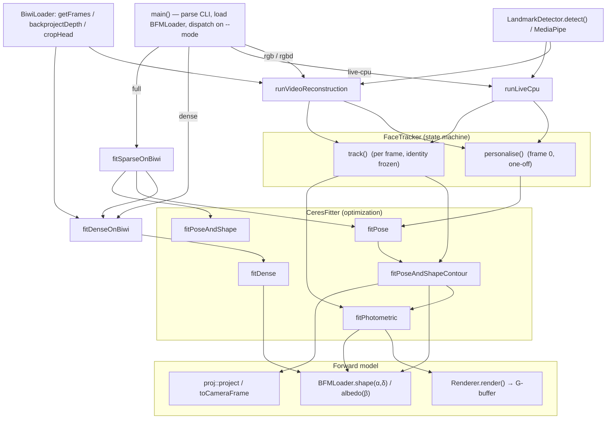

# Pipeline structure

An architectural map of the C++ face-reconstruction pipeline: what each module
owns, the stages data flows through, the key function at each stage, and how the
modes wire them together. Line numbers are omitted on purpose (they drift) —
grep the function name in the listed file.

Fits a Basel Face Model (BFM 2017) to RGB(-D) input by optimising identity α,
expression δ, albedo β, spherical-harmonic lighting γ, and rigid pose (R, t)
against sparse landmarks, a jaw-silhouette contour, dense depth, and a dense
per-pixel photometric term.

---

## 1. Module map

| File | Owns |
|---|---|
| `src/main.cpp` | CLI parsing, mode dispatch, per-mode orchestration, all debug/overlay rendering |
| `src/BFMLoader.cpp` | The 3DMM: mean shape/albedo, PCA bases + σ, topology, named landmarks |
| `src/BiwiLoader.cpp` | Dataset I/O (RGB / depth / GT pose / calibration) + depth→point-cloud helpers |
| `src/LandmarkDetector.cpp` | In-process 2D landmarks (YuNet / LBF). MediaPipe arrives via Python (offline files or the live coprocess) |
| `src/CeresFitter.cpp` | **All optimization** — pose, shape, expression, albedo, lighting (Ceres solvers + residual terms) |
| `src/render/{Renderer,ProjectionUtils,Lighting}.cpp` | The differentiable renderer (the forward model) |
| `src/FaceTracker.cpp` | The **personalise-then-track** state machine, shared by the video and live modes |

---

## 2. Key types

- `PoseParameters` — angle-axis rotation + translation (mm). `rotationMatrix()` builds R.
- `FitParameters` — one fit result: `pose`, `shapeCoefficients` (α), `exprCoefficients` (δ), `albedoCoefficients` (β), `sh` (γ).
- `LandmarkObservation` — `{ vertexIndex, imagePoint }`. `vertexIndex ≥ 0` = fixed interior landmark; `-1` = jaw-contour point (its model vertex is re-matched every ICP iteration).
- `RenderInput` / `RenderOutput` — renderer I/O. The output G-buffer (`image`, `depth`, `mask`, `triIdx`, `bary`) is what the photometric term differentiates through.

Coefficient counts live in `include/CeresFitter.h`: `kShapeCoefficientCount` (identity), `kExpressionCoefficientCount`, `kAlbedoCoefficientCount`.

---

## 3. Call graph



---

## 4. Stages (data flow)

### Stage 0 — Startup & dispatch (`main.cpp`)
`main()` parses flags, constructs `BFMLoader`, and dispatches on `--mode` to one
orchestrator (`runVideoReconstruction`, `runLiveCpu`, `fitDenseOnBiwi`,
`fitSparseOnBiwi` + `fitDenseOnBiwi`, or the `runLiveGpu` stub).

### Stage 1 — The face model (`BFMLoader`)
Loaded once from the `.h5`. The parametric prior everything fits into.
- `mean_shape()`, `albedo()` — the neutral (androgynous) geometry & colour.
- `shape(α)` / `shape(α, δ)` — geometry from identity (+ expression).
- `albedo(β)` — per-vertex colour from colour coeffs.
- `shape_basis_raw()` / `shape_sigma()` / `expr_basis_raw()` / `color_basis_raw()` / `faces()` — PCA bases, σ, topology.
- `landmark_index(name)` — named landmark → vertex index.

### Stage 2 — Input & landmarks
- **Dataset** (`BiwiLoader`): `getFrames()` (RGB + `readDepthBin()` + GT head pose), `getCalibration()` (K + RGB↔depth extrinsics).
- **Depth → cloud**: `backprojectDepth()` → `cropHead()` produce the metric point cloud the depth term fits (in the RGB camera frame via the extrinsics).
- **2D landmarks**: `LandmarkDetector::detect()` (→ `faceBox()`), *or* MediaPipe — offline `python/gen_landmarks_mediapipe.py` files, or the live `MpLandmarkStream` coprocess in `main.cpp`. Output is `std::vector<LandmarkObservation>`.

### Stage 3 — Forward model (differentiable renderer)
Renders outputs *and* serves as the analysis-by-synthesis model inside `fitPhotometric`.
- Geometry→camera→pixels: `proj::toCameraFrame`, `project`, `projectMesh`, `normalsToCameraFrame`, and the `BFM_TO_CAM` axis flip.
- `Renderer::computeNormals` → `light::shBasis` / `shadeVertices` / `defaultWhite`.
- `Renderer::render()` → `backfaceMask()` → `rasterize()` → `interpolateShading()`, producing the G-buffer.

### Stage 4 — Optimization (`CeresFitter`)
**Solvers** (coarse → fine):
- `fitPose()` — stage-1 pose only (mean shape).
- `fitPoseAndShape()` — pose + identity from landmarks (the `full` sparse stage).
- `fitPoseAndShapeContour()` — **the workhorse**: pose + identity + expression from interior landmarks + sliding **jaw-contour** ICP (+ optional **depth** ICP). Called by both `personalise` and `track`. Outer loop re-matches contour/depth correspondences each iteration.
- `fitDense()` — depth-only ICP (`dense` / `full` modes).
- `fitPhotometric()` — analysis-by-synthesis: (1) linear SH **lighting**, (2) linear **albedo** β, (3) per-pixel **geometry** Ceres solve. Optionally adds a **joint landmark term** (E_col + E_lan) so a low shape-reg is safe.

**Residual terms** (the energy, as Ceres `struct`s):
- `LandmarkReprojectionResidual` — pose-only reprojection.
- `LandmarkShapeReprojectionResidual` — pose+shape reprojection (also the joint landmark anchor in `fitPhotometric`).
- `LandmarkFocalReprojectionResidual<WithExpr,WithId>` — pose+id+expr+focal; `WithId=false` bakes the frozen identity in during tracking (cheaper autodiff).
- `DepthPointResidual` — point-to-point + point-to-plane depth.
- `PhotometricPixelResidual` — per-pixel render-vs-photo (the dense term).
- Priors: `ShapeRegularizationResidual` (identity L2), `CoeffPriorResidual` (expression, zero-anchored), `CoeffAnchorResidual` (temporal, `‖δ−δ_prev‖`), `FocalPriorResidual`.
- Linear appearance: `estimateSHLighting`, `estimateAlbedoCoeffs`, `albedoFromBeta` (sampled via `AppearanceSample`).

### Stage 5 — State machine (`FaceTracker`)
Decides *what* is solved *when*.
- `personalise()` — one-off per subject: `fitPose` → `fitPoseAndShapeContour` (identity + expression from landmarks/contour/depth) → coarse-to-fine `fitPhotometric` pyramid (albedo + lighting + a joint photometric+landmark identity refinement).
- `track()` — per frame, identity **frozen**: constant-velocity warm start → `fitPoseAndShapeContour` (pose + expression only) → optional photometric pose refine + lighting refresh → temporal EMA smoothing + detection gating.
- Helpers: `reset()`, `interiorRms()` (the refinement guard), `currentShape()` / `currentAlbedo()` (for rendering).

### Stage 6 — Output (`main.cpp`)
- Per-frame 3-panel composite via `blendRenderOnPhoto()` + `renderMaskPanels()`: **overlay | reconstruction @ pose | reconstruction frontal**.
- Single-frame modes: `writeFitOutputs()`, `overlayWireframe()`, `saveCurrentModel()` (.obj).
- Live: `drawKeypointsDebug()`, `projectiveTexture()` (`--photo-texture`), three imshow windows.

---

## 5. End-to-end flows

**Offline video** (`rgb` / `rgbd`) — `runVideoReconstruction`:
```
frame 0 : tracker.personalise
            └─ fitPose → fitPoseAndShapeContour(+depth) → fitPhotometric pyramid
frame k : tracker.track  (identity frozen)
            └─ fitPoseAndShapeContour(pose+expr) → lighting refresh → EMA smooth
→ 3-panel composite per frame (+ tracking.mp4)
```

**Single-frame** (`full`) — `fitSparseOnBiwi` → `fitDenseOnBiwi`:
```
fitSparseOnBiwi : fitPose → fitPoseAndShape            (RGB landmarks)
fitDenseOnBiwi  : fitDense (depth ICP, transferred to the depth camera via
                  extrinsics) → projective texture + RGB/depth overlays
```

**Live** (`live-cpu`) — `runLiveCpu`: same `personalise`/`track` split as the
video path, fed by the camera + MediaPipe coprocess, with the three live debug
windows.

---

See `RUNNING.md` for how to build and invoke each mode, and
`PIPELINE_PARAMETERS.md` for the tunable weights.
